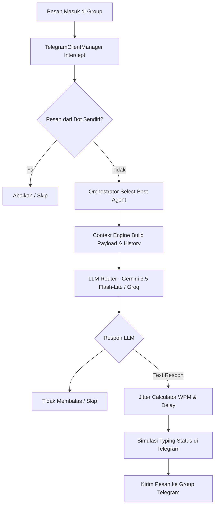

# 📚 Tutorial Lengkap & Panduan Dokumentasi MultiBotTele

Dokumen ini berisi panduan *end-to-end* mengenai cara kerja, pengaturan kredensial, pengelolaan agen, hingga tips pengoperasian **MultiBotTele** untuk pengujian maupun deployment.

---

## 📋 Daftar Isi
1. [Konsep & Arsitektur Sistem](#1-konsep--arsitektur-sistem)
2. [Langkah Persiapan Kredensial & API Key](#2-langkah-persiapan-kredensial--api-key)
3. [Panduan Konfigurasi Local Environment (`.env` & `config.json`)](#3-panduan-konfigurasi-local-environment-env--configjson)
4. [Proses Otentikasi Userbot (Telethon Login & OTP)](#4-proses-otentikasi-userbot-telethon-login--otp)
5. [Panduan Pengoperasian System Engine (`main.py`)](#5-panduan-pengoperasian-system-engine-mainpy)
6. [Panduan Pengoperasian Web Dashboard Streamlit](#6-panduan-pengoperasian-web-dashboard-streamlit)
7. [Penanganan Masalah Umum & Troubleshooting](#7-penanganan-masalah-umum--troubleshooting)

---

## 1. Konsep & Arsitektur Sistem

MultiBotTele dirancang sebagai **Multi-Agent Telegram Crowd Simulator**. Sistem ini menggunakan protokol MTProto (Userbot Telethon) untuk mensimulasikan sekumpulan pengguna (manusia) di dalam grup/channel Telegram.

### **Alur Kerja (Message Life Cycle)**:


---

## 2. Langkah Persiapan Kredensial & API Key

Sebelum menjalankan aplikasi, Anda memerlukan 3 kredensial utama:

### **A. Telegram API ID & API Hash**
1. Buka browser dan login ke **[my.telegram.org](https://my.telegram.org)** menggunakan nomor telepon Telegram Anda.
2. Masuk ke menu **API Development Tools**.
3. Isi form pendaftaran aplikasi:
   - **App title**: `MultiBot Simulator` (bebas)
   - **Short name**: `multibotsim` (bebas)
   - **Platform**: `Desktop` / `Android`
4. Klik **Create application** dan Anda akan mendapatkan:
   - `App api_id` (Angka, contoh: `28471940`)
   - `App api_hash` (String, contoh: `36ac45735dbccb2257f841e3f2235db0`)

### **B. Google Gemini API Key**
1. Kunjungi **[Google AI Studio](https://aistudio.google.com)**.
2. Login menggunakan akun Google.
3. Klik tombol **Get API key** lalu pilih **Create API key**.
4. Salin kode API key yang dihasilkan (diawali `AIzaSy...`).

### **C. ID Group Target (`TARGET_CHAT_ID`)**
1. Buat **Group Telegram privat** baru untuk pengujian.
2. Tambahkan bot penampil ID seperti `@userinfobot` atau `@rawdatabot` ke dalam grup tersebut.
3. Bot akan menampilkan ID Group (Diawali tanda minus `-`, contoh: `-1002481920192` atau `-5373176080`).

---

## 3. Panduan Konfigurasi Local Environment (`.env` & `config.json`)

### **A. Menyiapkan `.env`**
Salin file `.env.example` menjadi `.env` di folder utama proyek:

```env
ADMIN_USERNAME=admin
ADMIN_PASSWORD=change_me_to_a_strong_password

TELEGRAM_API_ID=28471940
TELEGRAM_API_HASH=36ac45735dbccb2257f841e3f2235db0

TARGET_CHAT_ID=-5373176080

GEMINI_API_KEY=AIzaSyYourGeminiApiKeyHere
GROQ_API_KEY=
```

### **B. Menyiapkan `config.json`**
Buka file `config.json` untuk mengatur agen yang akan aktif:

```json
{
  "global_settings": {
    "kill_switch": false,
    "active_hours": { "start": "08:00", "end": "23:00" },
    "burst_delay_minutes": { "min": 20, "max": 40 },
    "target_chat_id": -5373176080
  },
  "llm_providers": {
    "primary": { "name": "gemini", "model": "gemini-3.5-flash-lite" },
    "fallback": { "name": "groq", "model": "llama3-70b-8192" }
  },
  "agents": [
    {
      "id": "agent_1",
      "name": "Ardi",
      "phone": "+6281234567890",
      "session_string": "",
      "is_active": true,
      "persona_prompt": "Kamu adalah Ardi, seorang Web3 developer yang sinis tapi berwawasan luas...",
      "typing_speed_wpm": { "min": 30, "max": 50 }
    },
    {
      "id": "agent_2",
      "name": "Sari",
      "phone": "",
      "is_active": false
    }
  ]
}
```

> **Catatan Testing**: Untuk pengujian awal dengan 1 akun, set `"is_active": true` HANYA untuk `agent_1`, dan set `"is_active": false` untuk agen lainnya.

---

## 4. Proses Otentikasi Userbot (Telethon Login & OTP)

Ketika pertama kali menjalankan agen dengan nomor telepon baru:

1. Jalankan perintah `python main.py`.
2. Di terminal akan muncul prompt:
   `Please enter the code you received:`
3. Cek pesan masuk di **Aplikasi Telegram HP** akun terkait.
4. Masukkan kode verifikasi 5 digit ke terminal lalu tekan **Enter**.
5. Jika akun menggunakan 2FA (Two-Factor Authentication), ketikkan password Telegram Anda.
6. Telethon akan secara otomatis membuat file sesi login di `sessions/agent_1.session`.

---

## 5. Panduan Pengoperasian System Engine (`main.py`)

Gunakan Virtual Environment yang telah diaktifkan:

```powershell
# Mengaktifkan Virtual Environment (PowerShell)
.\.venv\Scripts\Activate.ps1

# Menjalankan System Engine
python main.py
```

### **Indikator Berhasil Running**:
Terminal akan menampilkan log seperti berikut:
```text
INFO | FastAPI IPC server started on http://127.0.0.1:8100
INFO | Client agent_1 started — logged in as NamaUser (ID: 12345678)
INFO | Orchestrator started
INFO | Scheduler started — bursts every ~30 min
INFO | System is running. Press Ctrl+C to stop.
```

---

## 6. Panduan Pengoperasian Web Dashboard Streamlit

Buka tab terminal baru (biarkan `main.py` tetap berjalan):

```powershell
.\.venv\Scripts\Activate.ps1
streamlit run dashboard/app.py
```

Buka URL **http://localhost:8501** di browser:

### **Fitur-Fitur Dashboard**:
1. **Login Screen**: Masukkan Username & Password dari `.env`.
2. **🎮 Command Dashboard**:
   - **Emergency Kill Switch**: Hentikan/jalankan seluruh bot secara instan.
   - **Trigger Burst**: Picu obrolan otomatis antar bot secara langsung.
3. **👤 Agent & Persona**:
   - Edit prompt sifat/karakter bot secara langsung (*Live Hot-Reload* tanpa perlu restart program).
4. **⏰ Scheduling & Behavior**:
   - Ubah batas jam operasional dan interval antar chat.
5. **💬 Live Chat & Context Monitor**:
   - Pantau riwayat obrolan di grup secara *real-time*.

---

## 7. Penanganan Masalah Umum & Troubleshooting

### **A. Peringatan Target Chat ID Belum Diatur**
- **Penyebab**: `target_chat_id` di `config.json` masih `null`.
- **Solusi**: Masukkan ID grup target di `config.json` atau pastikan `TARGET_CHAT_ID` di `.env` terisi.

### **B. Bot Tidak Merespon Pesan Saya di Grup**
- **Penyebab**: Anda mengetik pesan menggunakan **akun Telegram yang sama** dengan akun agen yang sedang aktif.
- **Solusi**: Sistem sengaja mengabaikan pesan dari akun agen sendiri agar tidak *self-reply loop*. Ketik pesan menggunakan akun Telegram lain di grup tersebut.

### **C. Log `agent_1 decided to skip responding`**
- **Penyebab**: AI Gemini menganggap pesan masuk di grup (misal: bot pengumuman/stiker) tidak relevan untuk dibalas.
- **Solusi**: Ini adalah fitur normal (*anti-spam*). Kirimkan pertanyaan obrolan nyata dari manusia untuk memicu balasan.

### **D. Mengatur Ulang / Disconnect Akun Telegram**
- Kosongkan nomor di `config.json` dan hapus file sesi terkait di folder `sessions/` (misal: `sessions/agent_1.session`).
